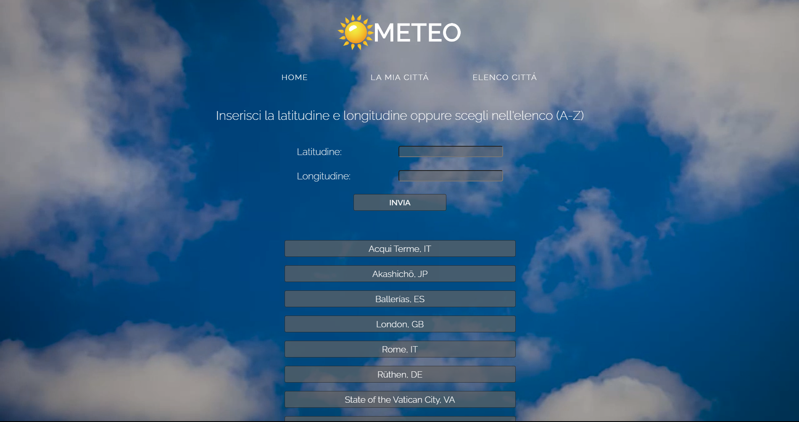

# Web and Mobile Programming Project

## Author: Angello Pomayay

I created this project as a part of my university exam for the Web and Mobile Programming course. It showcases the 
application of various technologies and concepts learned throughout the course. The project is built using JavaScript, 
and it uses MongoDB as DBMS to contain all the coordinates of all places inserted by users.

### MongoDB

MongoDB, a NoSQL database, is used for data storage in this project. Stores coordinates and city names.
The project includes scripts for creating the database and collections (`create_db.js` and
`cities_coordinates_db.js`), as well as functions for updating and retrieving data from the database (`server.js`).

## Project Structure

The project consists of several JavaScript files:

- `server.js`: This is the main server file. It handles API calls, data processing, and interaction with the MongoDB database. It also sets up routes and starts the server using Express.js.
- `cities_coordinates_db.js`: This file is responsible for creating the MongoDB collection that stores city coordinates.
- `create_db.js`: This script creates the MongoDB database used in the project.

## APIs and Data

The project uses the OpenWeatherMap API to fetch weather data for different cities. The data is then processed and
stored in the MongoDB database. The stored data includes city name and coordinates.

## Conclusion

This project is a comprehensive demonstration of the skills and knowledge acquired in the Web and Mobile Programming
course. It combines various technologies and concepts, including JavaScript, Node.js, Express.js, npm, MongoDB, and API 
usage, to create a functional weather information application.

## Future Improvements

I've chosen to use coordinates to identify cities in this project just to make it different, but I will add a search bar
as well, so users can search for cities by name. The initial idea was to put a predefined list of cities in the database
and if the user didn't find the city he was looking for, he could add it to the database by inserting the coordinates, A
sort of community-driven database.

## Screenshots

    

